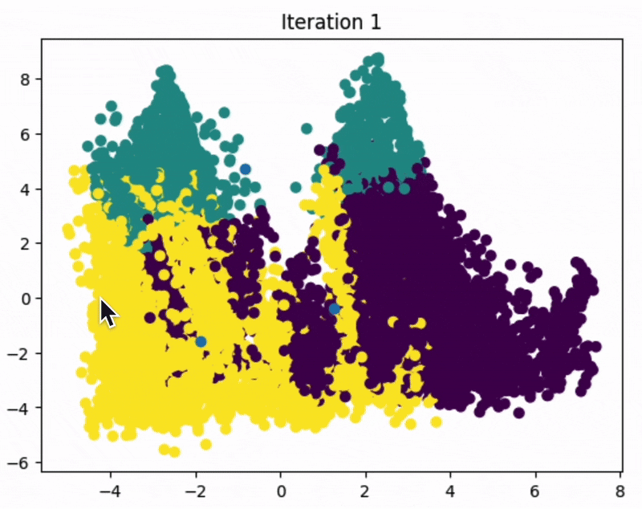

# K-Means Clustering Implementation from Scratch

## Overview

This Jupyter notebook provides a comprehensive implementation of the K-means clustering algorithm built from the ground up using Python, pandas, and NumPy. The project demonstrates how unsupervised machine learning algorithms work by manually implementing each component of K-means, then comparing the results with scikit-learn's optimized implementation.

Using the California housing dataset, this notebook walks through the entire machine learning pipeline: data preprocessing, algorithm implementation, visualization, and performance comparison. The goal is to provide both theoretical understanding and practical experience with clustering algorithms.



## Table of Contents

- [Installation](#installation)
- [Project Structure](#project-structure)
- [Key Features](#key-features)
- [Learning Outcomes](#learning-outcomes)
- [Usage](#usage)
- [Dependencies](#dependencies)
- [Contributing](#contributing)

## Installation

1. Clone this repository
2. Install required dependencies:
   ```bash
   pip install pandas numpy matplotlib scikit-learn ipython
   ```
3. Launch Jupyter Notebook:
   ```bash
   jupyter notebook k_means_housing.ipynb
   ```

## Project Structure

### Section 1: Importing Data
- **Data Loading**: Imports the California housing dataset (`housing.csv`) using pandas
- **Feature Selection**: Identifies relevant features for clustering analysis
- **Data Cleaning**: Removes missing values and prepares the dataset for processing

**Note**: The `housing.csv` file must be in the same directory as the notebook for the data loading to work properly.

### Section 2: Scaling Data and Helper Functions

#### Section 2.1: Data Scaling
- Implements Min-Max scaling to normalize features to a 1-10 range
- Explains why scaling is crucial for K-means clustering
- Demonstrates the scaling transformation and validates results

#### Section 2.2: Random Centroid Initialization
- Creates the `random_centroids()` function to generate initial cluster centers
- Uses random sampling from existing data points to ensure centroids fall within the data distribution
- Explains the impact of different random initializations

#### Section 2.3: Labeling Data Points
- Implements the `get_labels()` function using Euclidean distance calculations
- Assigns each data point to the nearest cluster center
- Shows how distance matrices work in clustering algorithms

#### Section 2.4: K-means Algorithm Implementation
- Builds the complete iterative K-means algorithm
- Implements the `new_centroids()` function to update cluster centers
- Creates the main convergence loop that runs until centroids stabilize
- Includes real-time visualization using PCA for 2D representation

### Section 3: Comparing with Scikit-Learn's KMeans
- **Professional Implementation**: Demonstrates scikit-learn's optimized K-means
- **Performance Comparison**: Analyzes differences between custom and professional implementations
- **Feature Analysis**: Compares cluster characteristics and centroid values
- **Interpretation**: Discusses the practical implications of different clustering results

## Key Features

- **Custom Implementation**: Complete K-means algorithm built from scratch
- **Real-time Visualization**: Interactive plots showing algorithm convergence
- **Educational Approach**: Detailed explanations of each step and mathematical concept
- **Practical Application**: Real-world dataset demonstrating clustering applications
- **Performance Analysis**: Comparative evaluation against scikit-learn
- **Modular Code**: Self-contained functions that can be reused

## Learning Outcomes

After completing this notebook, you will understand:

- How K-means clustering works internally
- The importance of data preprocessing and feature scaling
- Iterative optimization and convergence criteria
- Distance calculations and centroid updates
- Visualization techniques for high-dimensional data
- Differences between custom and optimized implementations
- When and how to apply clustering in real projects

## Usage

1. **Run the notebook sequentially**: Each section builds upon the previous one
2. **Experiment with parameters**: Try different values of k (number of clusters)
3. **Modify the dataset**: Apply the algorithm to your own data
4. **Compare results**: Observe how different initializations affect outcomes
5. **Analyze clusters**: Interpret the meaning of discovered groups

### Example Usage

```python
# Load and scale your data
data = pd.read_csv("your_data.csv")
scaled_data = ((data - data.min()) / (data.max() - data.min())) * 9 + 1

# Run custom K-means
centroids = random_centroids(scaled_data, k=3)
labels = get_labels(scaled_data, centroids)

# Compare with scikit-learn
from sklearn.cluster import KMeans
sklearn_kmeans = KMeans(n_clusters=3)
sklearn_labels = sklearn_kmeans.fit_predict(scaled_data)
```

## Dependencies

- **pandas**: Data manipulation and analysis
- **numpy**: Numerical computing
- **matplotlib**: Data visualization
- **scikit-learn**: Machine learning library (for comparison)
- **IPython**: Interactive computing environment

## File Structure

```
├── k_means_housing.ipynb    # Main notebook
├── housing.csv              # California housing dataset
├── README.md               # This file
└── requirements.txt        # Dependencies list
```

## Contributing

This is an educational project. Feel free to:

- Suggest improvements to the explanations
- Add additional visualizations
- Extend the algorithm to handle different distance metrics
- Create variations for other clustering algorithms

## Notes

- The algorithm may produce different results on each run due to random initialization
- Convergence time varies based on data complexity and initial centroid placement
- The visualization uses PCA for dimensionality reduction, which may not preserve all relationships
- Results may differ from scikit-learn due to different initialization strategies

## License

This project is for educational purposes. Feel free to use and modify for learning and teaching.
